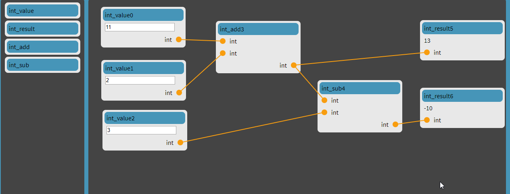

# FCL

FCLlib is a library to evaluate a graph of C/C++ function compositions. It has two front ends: CLI - takes a file in fcl lang and evaluates it, browser based graphical composition graph editor.

## CLI

For a file:
~~~
int one = '1'
int two = '2'
int_add_node = int_add(one.0, two.0)
int_mult_node = int_mult(int_add_node.0, int_add_node.0)
return mult_node.0
~~~

Cli frontend prints:
~~~
Serializers info
int
Functions info
int_add : int int -> int
int_sub : int int -> int
int_sub_node.0: '2'
~~~
Where on last line there is result of return.

## Graphical editor

## How to run
~~~
apt get install cmake g++
pip install conan
git clone https://github.com/JakubSzczerbinski/FCL.git
cd FCL
mkdir bin 
cd bin && cmake ..
make

# Run cli
./bin/fcl_cli --input-file <fcl_file>

# Run graphical
cd ../FCLws && ../bin/bin/fcl_ws -p 8080
~~~

